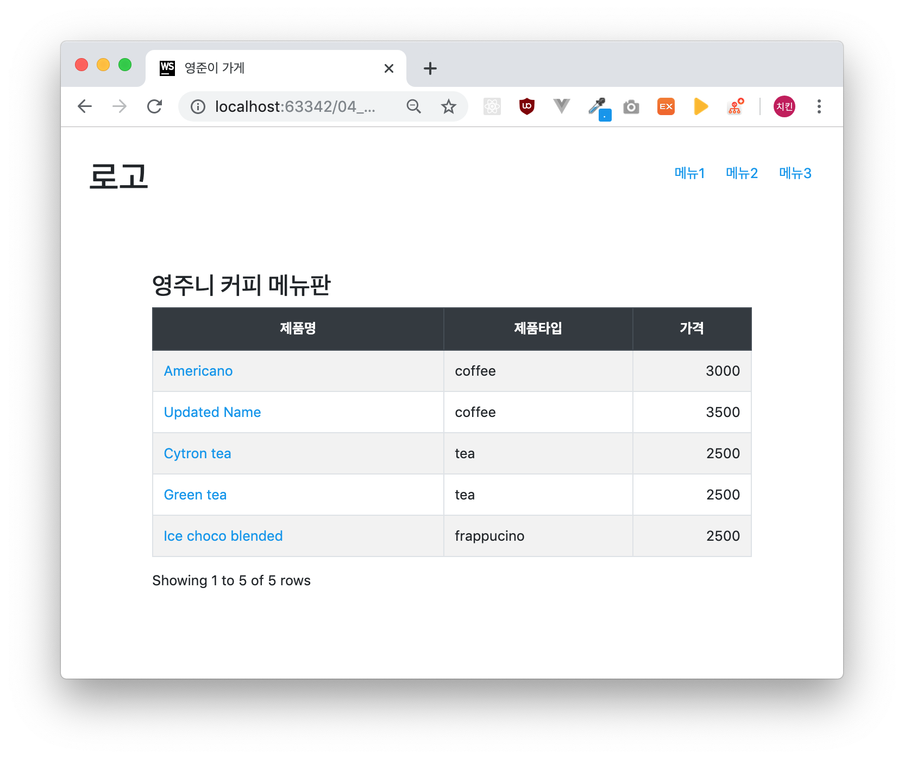
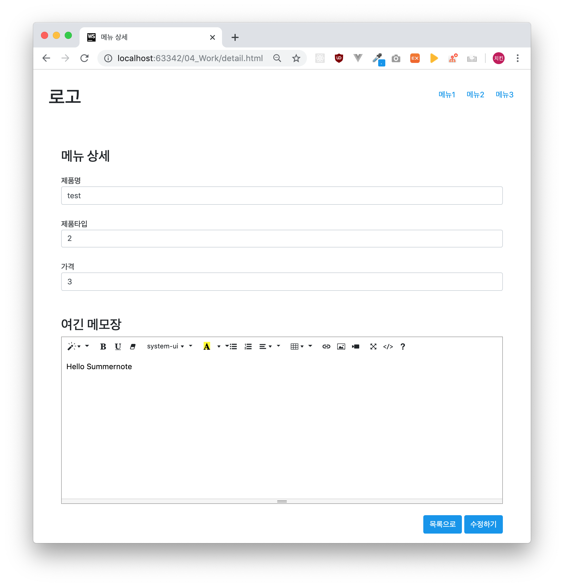

## Simple Bootstrap table & summernote

### How to work

#### Option1 - Basic version
1. Checkout `june` branch
2. Open index.html

#### Option2 - Express version
1. Checkout `master` branch
2. `npm install`
3. Execute webServernode `node webServer.js`
4. Open index.html

That's it!
Enjoy simple bootstrap table & summernote.js.

### Example
- Main page
 
- Detail page
 

